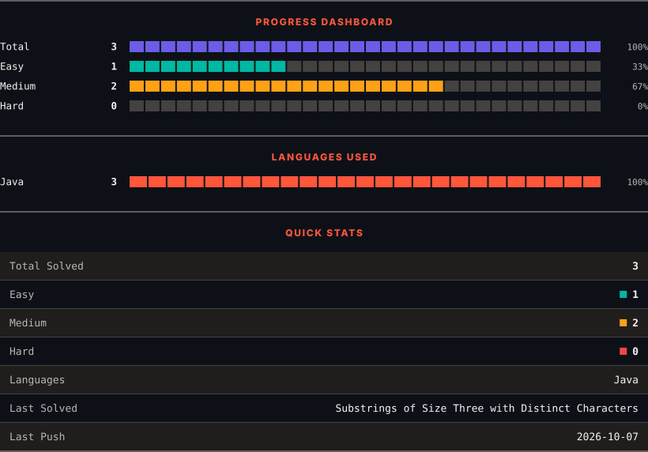
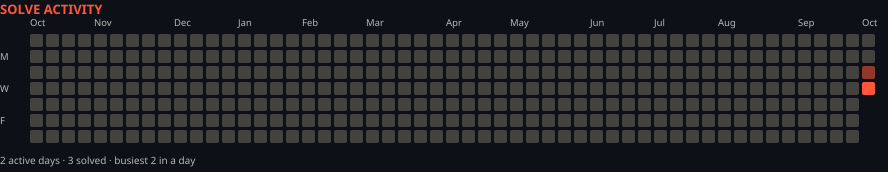

<h1>LeetCode Solutions</h1>

<em>Automatically synced with every accepted submission</em>

   

<picture>
  <source media="(prefers-color-scheme: dark)" srcset=".leetsync/stats-dark.svg">
  <source media="(prefers-color-scheme: light)" srcset=".leetsync/stats-light.svg">
  
</picture>

<picture>
  <source media="(prefers-color-scheme: dark)" srcset=".leetsync/calendar-dark.svg">
  <source media="(prefers-color-scheme: light)" srcset=".leetsync/calendar-light.svg">
  
</picture>

---

### ALL SOLUTIONS

| # | Problem | Difficulty | Language | Date |
|:---:|:--------|:----------:|:--------:|:----:|
| 1343 | [Number of Sub-arrays of Size K and Average Greater than or Equal to Threshold](problems/1343-Number-of-Sub-arrays-of-Size-K-and-Average-Greater-than-or-Equal-to-Threshold) | 🟧 Medium | `Java` | 2026-10-06 |
| 1456 | [Maximum Number of Vowels in a Substring of Given Length](problems/1456-Maximum-Number-of-Vowels-in-a-Substring-of-Given-Length) | 🟧 Medium | `Java` | 2026-10-07 |
| 1876 | [Substrings of Size Three with Distinct Characters](problems/1876-Substrings-of-Size-Three-with-Distinct-Characters) | 🟩 Easy | `Java` | 2026-10-07 |

---

Auto-synced by <strong>LeetSync</strong> · Built by <a href="https://deveshsamant.in/">Devesh Samant</a>

