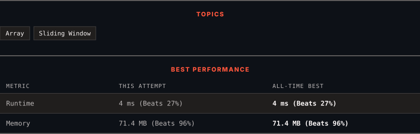

<div align="center">

# 1343. Number of Sub-arrays of Size K and Average Greater than or Equal to Threshold

      

[](https://leetcode.com/problems/number-of-sub-arrays-of-size-k-and-average-greater-than-or-equal-to-threshold/)

</div>

---

<div align="center">

<picture>
  <source media="(prefers-color-scheme: dark)" srcset="panel-dark.svg">
  <source media="(prefers-color-scheme: light)" srcset="panel-light.svg">
  
</picture>

</div>

### HOW IT WENT

| | |
|:--|:--|
| **Attempts** | first try |
| **Time to solve** | 30 min |
| **Verdicts** | ✅ Accepted |

---

### NOTES

_No notes yet._

---

### SOLUTIONS (2)

| # | File | Language | Date |
|:-:|------|:--------:|:----:|
| 1 | [sol1.java](./sol1.java) | `Java` | 2026-10-06 |
| 2 | [sol2.java](./sol2.java) | `Java` | 2026-10-06 ← **latest** |

---

### PROBLEM DESCRIPTION

Given an array of integers `arr` and two integers `k` and `threshold`, return *the number of sub-arrays of size *`k`* and average greater than or equal to *`threshold`.

 

**Example 1:**

```

**Input:** arr = [2,2,2,2,5,5,5,8], k = 3, threshold = 4
**Output:** 3
**Explanation:** Sub-arrays [2,5,5],[5,5,5] and [5,5,8] have averages 4, 5 and 6 respectively. All other sub-arrays of size 3 have averages less than 4 (the threshold).

```

**Example 2:**

```

**Input:** arr = [11,13,17,23,29,31,7,5,2,3], k = 3, threshold = 5
**Output:** 6
**Explanation:** The first 6 sub-arrays of size 3 have averages greater than 5. Note that averages are not integers.

```

 

**Constraints:**

	- `1 <= arr.length <= 10^5`

	- `1 <= arr[i] <= 10^4`

	- `1 <= k <= arr.length`

	- `0 <= threshold <= 10^4`

---

<div align="center">

<sub>Auto-synced by <strong>LeetSync</strong> · Built by <a href="https://deveshsamant.in/">Devesh Samant</a></sub>

</div>
