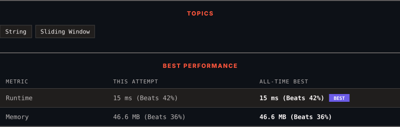

<div align="center">

# 1456. Maximum Number of Vowels in a Substring of Given Length

      

[](https://leetcode.com/problems/maximum-number-of-vowels-in-a-substring-of-given-length/)

</div>

---

<div align="center">

<picture>
  <source media="(prefers-color-scheme: dark)" srcset="panel-dark.svg">
  <source media="(prefers-color-scheme: light)" srcset="panel-light.svg">
  
</picture>

</div>

> **New personal best** — Runtime improved on this submission.

### HOW IT WENT

| | |
|:--|:--|
| **Attempts** | first try |
| **Time to solve** | under a minute |
| **Verdicts** | ✅ Accepted |

---

### NOTES

_No notes yet._

---

### SOLUTIONS (1)

| # | File | Language | Date |
|:-:|------|:--------:|:----:|
| 1 | [sol1.java](./sol1.java) | `Java` | 2026-10-07 ← **latest** |

---

### PROBLEM DESCRIPTION

Given a string `s` and an integer `k`, return *the maximum number of vowel letters in any substring of *`s`* with length *`k`.

**Vowel letters** in English are `'a'`, `'e'`, `'i'`, `'o'`, and `'u'`.

 

**Example 1:**

```

**Input:** s = "abciiidef", k = 3
**Output:** 3
**Explanation:** The substring "iii" contains 3 vowel letters.

```

**Example 2:**

```

**Input:** s = "aeiou", k = 2
**Output:** 2
**Explanation:** Any substring of length 2 contains 2 vowels.

```

**Example 3:**

```

**Input:** s = "leetcode", k = 3
**Output:** 2
**Explanation:** "lee", "eet" and "ode" contain 2 vowels.

```

 

**Constraints:**

	- `1 <= s.length <= 10^5`

	- `s` consists of lowercase English letters.

	- `1 <= k <= s.length`

---

<div align="center">

<sub>Auto-synced by <strong>LeetSync</strong> · Built by <a href="https://deveshsamant.in/">Devesh Samant</a></sub>

</div>
