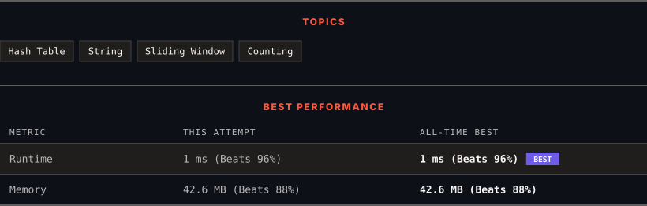

<div align="center">

# 1876. Substrings of Size Three with Distinct Characters

      

[](https://leetcode.com/problems/substrings-of-size-three-with-distinct-characters/)

</div>

---

<div align="center">

<picture>
  <source media="(prefers-color-scheme: dark)" srcset="panel-dark.svg">
  <source media="(prefers-color-scheme: light)" srcset="panel-light.svg">
  
</picture>

</div>

> **New personal best** — Runtime improved on this submission.

### HOW IT WENT

| | |
|:--|:--|
| **Attempts** | first try |
| **Time to solve** | 13 h 56 min |
| **Verdicts** | ✅ Accepted |

---

### NOTES

_No notes yet._

---

### SOLUTIONS (1)

| # | File | Language | Date |
|:-:|------|:--------:|:----:|
| 1 | [sol1.java](./sol1.java) | `Java` | 2026-10-07 ← **latest** |

---

### PROBLEM DESCRIPTION

A string is **good** if there are no repeated characters.

Given a string `s`​​​​​, return *the number of **good substrings** of length **three **in *`s`​​​​​​.

Note that if there are multiple occurrences of the same substring, every occurrence should be counted.

A **substring** is a contiguous sequence of characters in a string.

 

**Example 1:**

```

**Input:** s = "xyzzaz"
**Output:** 1
**Explanation:** There are 4 substrings of size 3: "xyz", "yzz", "zza", and "zaz". 
The only good substring of length 3 is "xyz".

```

**Example 2:**

```

**Input:** s = "aababcabc"
**Output:** 4
**Explanation:** There are 7 substrings of size 3: "aab", "aba", "bab", "abc", "bca", "cab", and "abc".
The good substrings are "abc", "bca", "cab", and "abc".

```

 

**Constraints:**

	- `1 <= s.length <= 100`

	- `s`​​​​​​ consists of lowercase English letters.

---

<div align="center">

<sub>Auto-synced by <strong>LeetSync</strong> · Built by <a href="https://deveshsamant.in/">Devesh Samant</a></sub>

</div>
